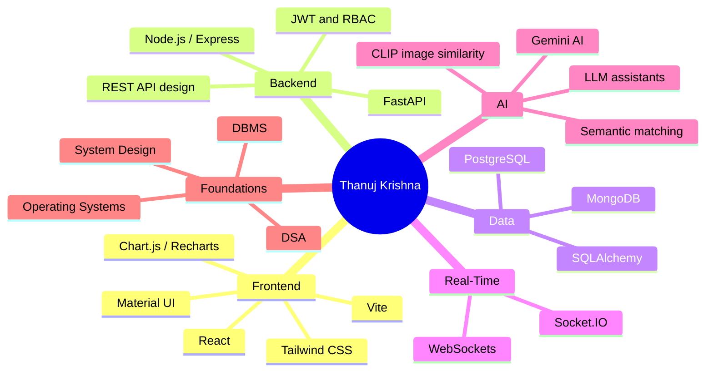

<!-- ═══════════════ HEADER ═══════════════ -->


<p align="center">
  <a href="https://github.com/thanujkrishna28">
    
  </a>
</p>

<p align="center">
  
  <a href="https://github.com/thanujkrishna28?tab=followers"></a>
  
</p>

<p align="center">
  <a href="#-about"></a>
  <a href="#-projects"></a>
  <a href="#-tech-stack"></a>
  <a href="#-stats"></a>
  <a href="#-connect"></a>
</p>


<!-- ═══════════════ ABOUT ═══════════════ -->

## ✨ About

<table>
<tr>
<td width="58%" valign="top">

I'm a **B.Tech Computer Science student from India** who builds software people can actually use. I design and ship **full stack platforms** with authentication, role-based access, real-time features and analytics. Lately I've been adding **AI** to those workflows, from image-similarity matching to LLM-generated meeting minutes.

I care about clean architecture, sensible APIs and products that solve genuine institutional and real-world problems: campuses, hospitals, hostels, events and governance.

</td>
<td width="42%" valign="top">

```yaml
name:       Thanuj Krishna
role:       Full Stack Developer
focus:      AI-integrated web systems
education:  B.Tech, CSE
location:   India 📍
core:       [DSA, OS, DBMS]
building:   Scalable role-based platforms
learning:   System Design, Cloud, AI
goal:       Software Engineer
```

</td>
</tr>
</table>

<br/>

<div align="center">

| 🚀 **6** | 🔌 **20+** | 🔐 **5** | 🤖 **3** | ⚡ **3** |
|:---:|:---:|:---:|:---:|:---:|
| Full stack products | REST APIs (Schedulo alone) | Role-based access systems | AI-integrated platforms | Real-time systems |

</div>


<!-- ═══════════════ PROJECTS ═══════════════ -->

## 🚀 Projects

> Every project below is a full stack application with authentication, role-based workflows and a database-backed API. Most are deployed and live.

<br/>

<!-- ───────── 1. SCHEDULO ───────── -->
<table>
<tr>
<td>

### 🗓️ Schedulo — Smart Campus Automation & Scheduling Platform
<sub>`Campus Automation` · `Scheduling` · `Real-Time` · `Analytics`</sub>

A full stack platform that automates **examination scheduling and invigilator allocation**. It gives administrators, HODs and faculty their own workflows, and allocates invigilators automatically based on scheduling constraints, replacing hours of manual spreadsheet work.

<details>
<summary><b>⚡ Key highlights</b></summary>

- 🔐 **JWT authentication** with **role-based access control** for Admin, HOD and Faculty
- 🔌 **20+ REST APIs** covering scheduling, allocation and user management
- 🧠 **Constraint-based automated invigilator allocation**
- 📊 **Analytics dashboards** for exam and allocation insights
- ⚡ **Real-time updates** using Socket.IO
- 🗄️ MongoDB data modelling for exams, rooms, faculty and schedules

</details>


<a href="https://schedulo-tawny.vercel.app/login"></a>
<a href="https://github.com/thanujkrishna28/Schedulo"></a>

</td>
</tr>
</table>

<!-- ───────── 2. RECOVERA ───────── -->
<table>
<tr>
<td>

### 🔍 Recovera — AI-Powered Lost & Found Platform
<sub>`Computer Vision` · `Semantic Search` · `Notifications` · `AI Inference`</sub>

A lost-and-found platform that helps people **report, search and recover missing items**. Instead of relying on keyword search, it uses **semantic matching and CLIP-based image similarity** to surface likely matches between lost and found reports.

<details>
<summary><b>⚡ Key highlights</b></summary>

- 🖼️ **CLIP-based image similarity** to match photos of lost and found items
- 💬 **Semantic matching** of item descriptions beyond exact keywords
- 🔄 End-to-end **matching workflow**: report → match → claim → recover
- 🔔 **Notifications** when a potential match is found
- 👥 User interactions and item management
- 🧬 **AI inference integrated into the application backend** (Node.js + Python)

</details>


<a href="https://recovera-three.vercel.app/"></a>
<a href="https://github.com/thanujkrishna28/Recovera"></a>

</td>
</tr>
</table>

<!-- ───────── 3. MEDCLUES ───────── -->
<table>
<tr>
<td>

### 🏥 MEDCLUES — AI-Powered Healthcare Platform
<sub>`HealthTech` · `Real-Time Queue` · `LLM` · `WebSockets`</sub>

A healthcare platform connecting **patients, doctors and administrators** through appointment booking, **digital queue management** and consultation workflows. Queue status stays in sync in real time, and AI features help with conversational support and slot suggestions.

<details>
<summary><b>⚡ Key highlights</b></summary>

- 📅 **Appointment booking** with role-specific dashboards for patients, doctors and admins
- 🧾 **Digital queue management** with real-time synchronisation
- 💬 **Live communication** over WebSockets / Socket.IO
- 🤖 **LLM-powered conversational assistant** and **AI appointment-slot suggestions**
- ⚙️ **FastAPI** backend with **PostgreSQL + SQLAlchemy** models
- 🩺 End-to-end consultation workflow

</details>


<a href="https://pms-patient.vercel.app/"></a>
<a href="https://github.com/thanujkrishna28/MEDCLUES"></a>

</td>
</tr>
</table>

<!-- ───────── 4. GATHERGO ───────── -->
<table>
<tr>
<td>

### 🎉 GatherGO — Event Management & Venue Booking Platform
<sub>`MERN` · `Marketplace` · `Booking Workflows` · `RBAC`</sub>

A MERN-based platform that simplifies **venue discovery, comparison, booking and occasion management**. It has separate workflows for **customers, venue owners, venue managers and administrators**, built like a real SaaS marketplace.

<details>
<summary><b>⚡ Key highlights</b></summary>

- 👥 **Four distinct roles**: Customer, Venue Owner, Venue Manager, Admin
- 🔐 **JWT authentication** with **role-based access control**
- 🏛️ Venue management, discovery and side-by-side comparison
- 💰 **Pricing and availability workflows**
- 📨 **Booking request** lifecycle for event operations
- 🔌 RESTful API layer for all event operations

</details>


<a href="https://github.com/thanujkrishna28/GatherGO"></a>


</td>
</tr>
</table>

<!-- ───────── 5. SHAMS ───────── -->
<table>
<tr>
<td>

### 🏨 SHAMS — Smart Hostel Accommodation Management System
<sub>`Digitisation` · `Room Allocation` · `Admin Dashboards` · `RBAC`</sub>

A role-based platform that **digitises hostel accommodation and administration**. Students, wardens, security and administrators each get dedicated access and workflows, replacing paper registers with a single system.

<details>
<summary><b>⚡ Key highlights</b></summary>

- 👥 **Four roles**: Student, Warden, Security, Admin, each with tailored workflows
- 🔐 **JWT authentication** and protected routes
- 🛏️ **Room allocation** and student management
- 🏢 Hostel operations management
- 📊 **Administrative dashboards**
- 🗄️ Clean database models and REST APIs for hostel data

</details>


<a href="https://shams-green.vercel.app/login"></a>
<a href="https://github.com/thanujkrishna28/SHAMS"></a>

</td>
</tr>
</table>

<!-- ───────── 6. COMMIAI ───────── -->
<table>
<tr>
<td>

### 🏛️ Vignan CommiAI — Statutory Committee Governance Agent
<sub>`GovTech` · `Compliance` · `Gemini AI` · `Real-Time`</sub>

An institutional **governance and compliance platform** for managing statutory committees in higher education. It serves **Registrars, Conveners, IQAC Coordinators and Committee Members**, and uses **Gemini AI** to turn meetings into structured minutes and trackable action items.

<details>
<summary><b>⚡ Key highlights</b></summary>

- 🧾 **Committee composition audits** and **tenure tracking**
- 📅 **Meeting management** with **live attendance and quorum validation**
- ✅ **Action-item and ATR (Action Taken Report) tracking**
- 📁 **Statutory document management**
- 🔔 **Institutional notifications**
- 🤖 **Gemini AI** generates structured **Minutes of the Meeting** and extracts **resolutions and action items**
- 📈 Compliance dashboards with **Chart.js** and **Recharts**

</details>


<a href="https://vignan-commiai-frontend.vercel.app/login"></a>
<a href="https://github.com/thanujkrishna28/Vignan-CommiAI"></a>

</td>
</tr>
</table>


<!-- ═══════════════ TECH STACK ═══════════════ -->

## 🧰 Tech Stack

<div align="center">

| Layer | Technologies |
|:---|:---|
| **Languages** |      |
| **Frontend** |      |
| **Backend** |     |
| **Real-Time** |   |
| **Databases** |    |
| **AI / ML** |     |
| **Cloud & Tools** |      |

</div>

<br/>

<details>
<summary><b>🗺️ Skill map (click to expand)</b></summary>



</details>


<!-- ═══════════════ HOW I BUILD ═══════════════ -->

## 🧠 How I Build

<table>
<tr>
<td width="33%" valign="top" align="center">

### 🏗️ Architecture
Layered APIs, clear data models and role-based access designed in from day one, not bolted on later.

</td>
<td width="33%" valign="top" align="center">

### ⚡ Real-Time First
Socket.IO / WebSockets for live queues, attendance, quorum checks and instant dashboard updates.

</td>
<td width="33%" valign="top" align="center">

### 🤖 Practical AI
AI only where it removes real work: matching items, drafting minutes, suggesting slots.

</td>
</tr>
</table>


<!-- ═══════════════ STATS ═══════════════ -->

## 📊 Stats

<p align="center">
  
  
</p>

<p align="center">
  
</p>

<p align="center">
  
</p>

<p align="center">
  
</p>

<!-- 🐍 Optional: uncomment after adding the snake.yml workflow (see snake.yml)
<p align="center">
  
</p>
-->


<!-- ═══════════════ ROADMAP ═══════════════ -->

## 🎯 Current Focus & Roadmap

| | Focus | Status |
|:-:|:--|:--|
| 🚀 | Shipping full stack, role-based products |  |
| 🤖 | Deeper AI integration (RAG, agents, embeddings) |  |
| ☁️ | Cloud deployment and CI/CD on AWS |  |
| 🏗️ | System design for scale |  |
| 📈 | DSA for placements |  |

<br/>

## 💡 Developer Mindset

> _"First, solve the problem. Then, write the code."_

- ✅ Clean, maintainable, well-structured code
- ✅ Real-world problems over tutorial clones
- ✅ Ship early, deploy live, iterate
- ✅ Continuous learning


<!-- ═══════════════ CONNECT ═══════════════ -->

## 🤝 Connect

<p align="center">
  <a href="https://linkedin.com/in/YOUR-LINKEDIN-USERNAME"></a>
  <a href="mailto:YOUR-EMAIL@gmail.com"></a>
  <a href="https://github.com/thanujkrishna28"></a>
</p>

<p align="center">
  💬 Ask me about <b>full stack development</b>, <b>AI integration</b>, or <b>building campus-scale systems</b>.<br/>
  📫 Open to <b>internships</b>, <b>full-time roles</b> and <b>collaborations</b>.
</p>


<p align="center"><i>⭐ Building • Learning • Growing every day</i></p>
